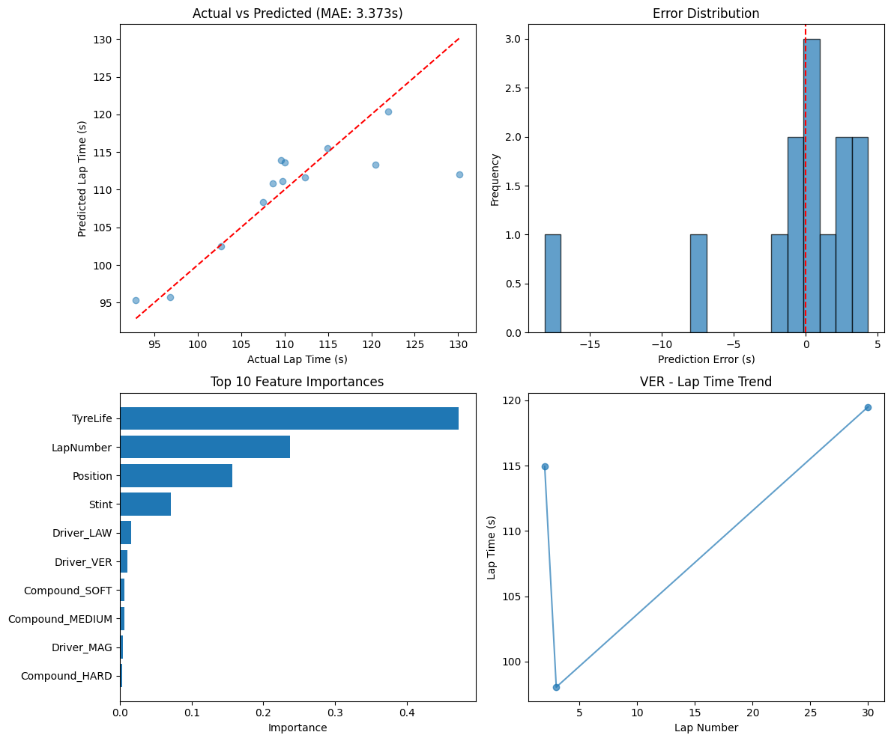

# 🏎️ F1 Lap Time Predictor

## **1. Purpose**

Predict Formula 1 lap times using machine learning. Built as a learning exercise to understand regression models, data cleaning, feature engineering, and model deployment. The goal is not perfect predictions but understanding *why* models make certain decisions and *how* F1 data behaves.

---

## **2. Problem Definition**

**Type:** Regression (predicting a continuous number - seconds)

**Input variables:**
- Lap number
- Tyre age (laps since new tyres)
- Stint number
- Race position
- Driver
- Tyre compound

**Output:** Lap time in seconds

---

## **3. Data Source**

**FastF1** - Open-source F1 data API

**Data collected:** 2024 Abu Dhabi Grand Prix (Round 24, user-specified via input)

**Why this race:** Complete dataset, typical race conditions, no weather interruptions.

---

## **4. Methodology - Step by Step**

### **Step 1: Data Loading**

```python
session = fastf1.get_session(season, round_num, 'R')
session.load(laps=True)
```

User provides season and round number. Code dynamically loads any race.

### **Step 2: Data Cleaning**

**Removed:**
- Lap 1 (standing start, collisions, unusual patterns)
- Laps with pit stops (PitInTime not null)
- Invalid lap times (NaT values)
- Outliers beyond 1.5 IQR

**Result:** 65 clean laps remaining for training.

### **Step 3: Feature Engineering**

**Features created:**
- Numerical: LapNumber, TyreLife, Stint, Position
- Categorical: Driver (one-hot encoded)
- Categorical: Compound (one-hot encoded)

**Target:** LapTimeSeconds (converted from timedelta)

**Final feature count:** 26 columns (including dummy variables)

### **Step 4: Model Selection**

**Final model:** Random Forest Regressor

**Why Random Forest:**
- Handles non-linear tyre degradation
- No feature scaling required
- Resists overfitting through averaging
- Provides feature importance for interpretation

**Hyperparameters:**
```python
RandomForestRegressor(
    n_estimators=100,
    max_depth=10,
    random_state=42
)
```

### **Step 5: Training Setup**

```python
X_train, X_test, y_train, y_test = train_test_split(
    features, target, test_size=0.2, random_state=42
)
```

- Training samples: 52 laps
- Test samples: 13 laps

---

## **5. Results**

### **Model Performance**

| Metric | Value |
|--------|-------|
| Mean Absolute Error (MAE) | 3.373 seconds |
| R² Score | 0.646 |

**Interpretation:** Model explains 64.6% of lap time variance. Average prediction misses by ~3.4 seconds.

### **Feature Importance**

| Feature | Importance |
|---------|------------|
| TyreLife | 47.19% |
| LapNumber | 23.71% |
| Position | 15.63% |
| Stint | 7.15% |
| Driver_LAW | 1.61% |
| Other drivers | <1.5% each |

**Key insight:** Tyre age dominates lap time prediction, followed by lap number and race position. Individual driver impact is minimal in this model.

### **Visualizations**



*Top left:* Actual vs predicted lap times  
*Top right:* Error distribution (centered near zero)  
*Bottom left:* Feature importance chart  
*Bottom right:* Lap time trend for sample driver

---

## **6. Analysis**

### **What the model learned correctly:**

1. **Tyre age matters most** (47%) - Confirms F1 reality: tyres degrade 0.1-0.3s per lap

2. **Lap number captures fuel burn** (24%) - Less fuel = faster laps

3. **Position affects pace** (16%) - Drivers in traffic or clear air have different lap times

### **Where the model struggles:**

1. **Limited data** - Only 65 usable laps from one race
2. **No weather data** - Cannot account for temperature or rain
3. **No car performance data** - Treats all cars as equal beyond driver
4. **Missing sector times** - Many laps had incomplete sector data

### **Error analysis:**

MAE of 3.37s means predictions are consistently off by multiple seconds. This is high for F1 (typical gaps are 0.5-1.0s). Main causes:
- Small dataset (65 laps)
- Missing key features (weather, car specs)
- Limited driver representation in test set

---

## **7. Limitations**

| Limitation | Impact | Fix |
|------------|--------|-----|
| Single race only | Model doesn't generalize | Train on multiple races |
| 65 laps only | High variance | Use full season data |
| No weather data | Rain breaks predictions | Add weather API |
| No car performance | Equalizes all cars | Add team/engine features |
| No sector times | Loses granularity | Better data cleaning |

---

## **8. What I Learned**

**Machine Learning:**
- Random Forest is beginner-friendly but not magic - needs data
- 65 samples is barely enough for 26 features (overfitting risk)
- One-hot encoding creates many columns with sparse data
- Feature importance confirms domain knowledge (tyres matter)

**F1 Domain:**
- Abu Dhabi GP has typical lap patterns
- Lap 1 and pit laps must be removed
- Tyre age is the strongest single predictor
- Position affects pace (traffic vs clean air)
---

## **9. Conclusion**

This project successfully builds a lap time predictor using Random Forest on F1 data from the 2024 Abu Dhabi GP. The model achieves 3.37s MAE and 0.646 R², identifying tyre age as the dominant factor (47% importance).

**Successes:**
- Complete pipeline from data loading to deployment
- One-hot encoding for categorical variables
- Working Streamlit UI
- Clear documentation

**Limitations accepted:**
- Small dataset (65 laps)
- Missing features (weather, car performance)
- Moderate prediction accuracy

**Final verdict:** A solid beginner project that demonstrates understanding of regression workflows, data cleaning, model selection, and deployment.

---

## **10. References**

- FastF1 Documentation: https://docs.fastf1.dev/
- Scikit-learn Random Forest: https://scikit-learn.org/stable/modules/generated/sklearn.ensemble.RandomForestRegressor.html
- Streamlit Docs: https://docs.streamlit.io/

---

*Built by Neha Roy | f1-ml-lab*
